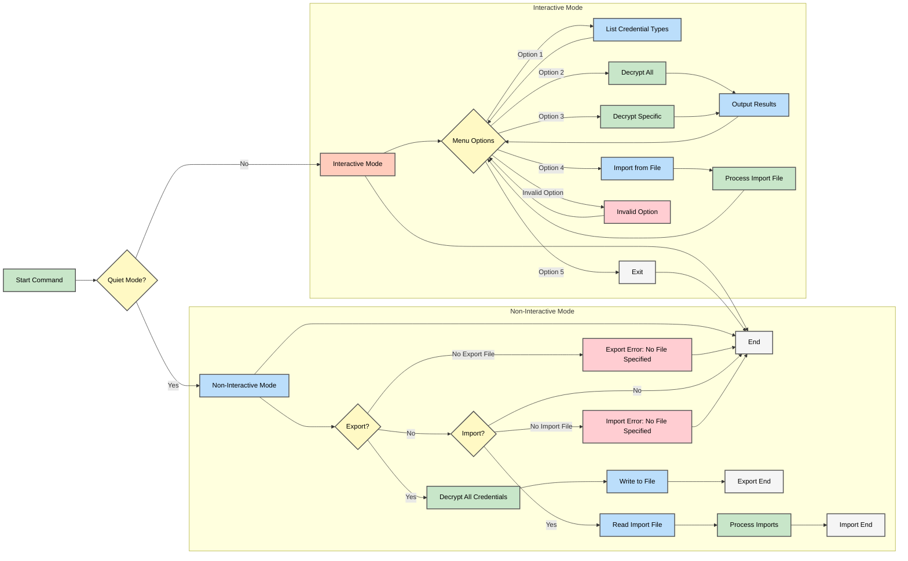

# AWX/AAP Credential Decrypt & Import Script

This script is designed for AWX/AAP environments to facilitate the decryption and import of credentials. It provides an interactive menu-based interface to:
- List all used Credential Types.
- Decrypt all credentials or selected ones.
- Import credentials from a JSON file.

This new version, **aapCreds.py**, includes enhanced flow control and a refined interactive menu (as illustrated in the flowchart below) to improve user experience.

---

## Table of Contents

- [Introduction](#introduction)
- [Features](#features)
- [Prerequisites](#prerequisites)
- [Flowchart of aapCreds.py](#flowchart-of-aapcredspy)
- [Installation and Setup](#installation-and-setup)
- [Usage Instructions](#usage-instructions)
- [Function Details](#function-details)
  - [list_used_credential_types](#list_used_credential_types)
  - [get_teams_from_role](#get_teams_from_role)
  - [decrypt_single_credential](#decrypt_single_credential)
  - [decrypt_credentials_by_ids](#decrypt_credentials_by_ids)
  - [decrypt_all_credentials](#decrypt_all_credentials)
  - [output_results](#output_results)
  - [import_credential](#import_credential)
  - [import_credentials_from_file](#import_credentials_from_file)
  - [main](#main)
- [Troubleshooting](#troubleshooting)
- [Contributing](#contributing)
- [License](#license)
- [Playbook Notes](#playbook-notes)

---

## Introduction

This script is a utility to manage AWX/AAP credentials by decrypting sensitive fields and importing credentials from a JSON file. It is meant to be executed within an AWX/AAP environment where all the necessary Django models and AWX-specific utilities are available.

---

## Features

- **List Credential Types:** Identify which credential types are currently in use.
- **Decrypt Credentials:** Decrypt secret fields (such as passwords and keys) for:
  - All stored credentials.
  - Specific credentials chosen by their IDs.
- **Import Credentials:** Import credentials from a JSON file with:
  - Duplicate checks.
  - Restoration of role memberships and job template associations.
- **Enhanced Interactive Menu:** The updated interactive menu offers a clearer, ordered selection of options, improving the overall flow control as visualized in the flowchart below.

---

## Prerequisites

- **AWX/AAP Environment:**  
  This script must run within an AWX/AAP environment because it requires access to AWX-specific Django models and utilities.

  _Tip:_ If running from within `awx-manage`, start an interactive shell with:
  ```shell
  awx-manage shell_plus
  ```
  Then execute the script within the environment as follows:
  ```shell
  exec(open('/path/of/aapCreds.py').read())
  ```

- **Python**:
  A compatible Python version (3.x+) installed within the AWX/AAP environment.
- **AWX/AAP Modules**:
  Ensure that the following modules are available:
    - awx.main.models (includes Credential, CredentialType, Organization, Project, JobTemplate, Team, Role, User)
    - awx.main.utils (provides decrypt_field)

---

## Flowchart of aapCreds.py

Below is the flowchart illustrating the overall flow of **aapCreds.py**. It demonstrates the two primary modes (non-interactive and interactive) along with the detailed menu options.



---

## Installation and Setup (Outside Playbooks)

### Running Script Outside of an Ansible Playbook

1. **Environment Verification**:
Confirm you have access to AWX models by running an interactive shell:
```shell
awx-manage shell_plus
```
If you do have access, proceed. If you don't, make sure you are on a server, typically a controller node, that does have access.

2. **Import and Script**:
Save the script as **aapCreds.py** onto your AWX/AAP server where the required Python environment is active (typically on your controller node). The location is usually found in `/var/lib/awx/venv/awx/lib/python3.9/site-packages/awx/main/management/commands`

3. **Apply Appropriate Permissions**:
This is optional considering the Django framework will read in the file and execute the code. However, just in case you need to make it executable, here's how:
```shell
chmod +x aapCreds.py
```

---

## Usage Instructions

1. ### Start the Script:

Become a user with elevated priveleges, typically root:

```shell
sudo su -
```

Drop into the Django ORM:

```shell
awx-manage shell_plus
```

Execute the script within an AWX shell:

```python
exec(open("/path/to/aapCreds.py").read())
```

**Note**: Alternatively, you can execute the script in the AWX/AAP environment **(Not Recommended)**

```shell
./aapCreds.py
```

2. ### Interactive Main Menu:

Upon execution, the script displays a menu with the following options:
  - **Option 1**: List all used Credential Types
  - **Option 2**: Decrypt ALL Credentials.
  - **Option 3**: Decrypt specific credentials by entering a comma-separated list of Credential IDs.
  - **Option 4**: Import credentials from a JSON file.
  - **Option 4**: Exit

3. ### Output Options (for Decryption):

After decryption, choose whether to:
  * Print the decrypted data to the console.
  * Save the decrypted data to a file.
  * Both print and save the results.

4. ### Import Process:

When importing, the script checks for duplicates (credentials with the same name, type, and organization) and logs any that are skipped.

---

## Function Details

### list_used_credential_types

    - **Purpose**:
        Retrieve a list of `CredentialType` objects that are actively used by at least one `Credential`.

    - **Implementation**:
        Collects distinct credential type IDs from the `Credential` objects and filters the `CredentialType` queryset accordingly.

### get_teams_from_role

    - **Purpose**:
        Given a `Role` object, returns the associated list of `Team` objects.

    - **Implementation**:
        Handles differences across AWX/AAP versions by checking for attributes like `team_set` or `teams`, iterating over related objects, if necessary.

### decrypt_single_credential

    - **Purpose**:
        Decrypts a single credential and builds a detailed dictionary including:

        - Credential metadata (ID, name, type, creation/modification dates)
        - Organization details
        - Access list (users and teams)
        - Related job templates
        - Decrypted input fields

    - **Implementation**:
        Iterates through each field, decrypting secret fields using `decrypt_field` while preserving original values for non-secret fields.

### decrypt_credentials_by_ids

    - **Purpose**:
        Fetches and decrypts credentials based on a list of provided Credential IDs.

    - **Implementation**:
        Uses Django's ORM to filter credentials by IDs, applying `decrypt_single_credential` for each.

### decrypt_all_credentials

    - **Purpose**:
        Decrypts every credential stored in the AWX system.

    - **Implementation**:
        Retrieves all credentials via the ORM and processes each eith `decrypt_single_credential`.

### ouput_results

    - **Purpose**:
       Provides options for outputting decrypted credentials:
        - Standard output (console)
        - Saving to a JSON file
        - Both

    - **Implementation**:
        Formats the output as JSON and prompts for the preferred method of display and storage.

### import_credential

    - **Purpose**:
        Imports a single credential from a dictionary (parsed from a JSON export).

    - **Implementation**:
        Validates the existence of the corresponding name, CredentialType, and Organization; checks for duplicates; then creates the new `Credential` object and restores role memberships and associations with job templates.

### import_credentials_from_file

    - **Purpose**:
        Imports multiple credentials from a JSON file.

    - **Implementation**:
        Reads JSON data from a specified file, iterating over each credential's data to invoke `import_credential`. Summarizes the count of imported credentials and lists duplicates skipped.

### main

    - **Purpose**:
        Serves as the primary control loop offering an interactive menu.

    - **Implemenation**:
        Displays the main menu with options to list credential types, decrypt credentials (all or specific), import credentials, or exit; processes user input accordingly until exit is chosen.

---

## Troubleshooting

- **Import Errors**:
    If errors occur regarding AWX/AAP models, ensure the script is run within the AWX/AAP environment.

- **Decryption Failures**:
    Should a decryption process fail for any field, the error is captured, and the field's value is set to `None`. Check console output for details.

- **File I/O Issues**:
    Verify that file paths provided for saving or importing JSON data are accessible and that proper permissions are set.

---

## Contributing

Contributions and improvements to the script are welcome. When submitting changes:
    - Ensure compatibility with the AWX/AAP environment.
    - Update this README accordingly.
    - Provide clear commit messages and documentation for any new features.

---

## License

This script is provides "as-is" without any warranty. Users are free to use, modify, and dsitribute the script, subject to any AWX/AAP licensing restrictions.

---

## Playbook Notes

Add the following task to your main playbook to import credentials:

```yaml
- name: Import ALL credentials from JSON (No Script)
  ansible.builtin.import_playbook: import_all_credentials.yml # Main playbook
  vars:
    credential_file: "/path/to/your/creds,json" # Specify the credentials file!
```

For testing outside the main playbook, you can use this temporary `main` playbook:

```yaml
---

- name: Main Playbook
  hosts: localhost
  gather_facts: false
  become: false

  tasks:
    - name: Import ALL credentials from JSON (No Script)
      ansible.builtin.import_playbook: import_all_credentials.yml # Main playbook
      vars:
        credential_file: "/path/to/your/creds.json" # Specify the credentials file!
```

