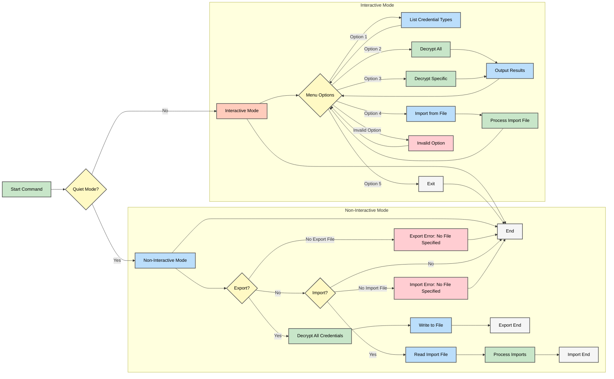

# AWX/AAP Credential Decrypt & Import Script

This script is designed for AWX/AAP environments to facilitate the decryption and import of credentials. It provides an interactive menu-based interface to:
- List all used Credential Types.
- Decrypt all credentials or selected ones.
- Import credentials from a JSON file.

This new version, **aapCreds.py**, includes enhanced flow control and a refined interactive menu (as illustrated in the flowchart below) to improve user experience.

---

## Table of Contents

- [Introduction](#introduction)
- [Features](#features)
- [Prerequisites](#prerequisites)
- [Flowchart of aapCreds.py](#flowchart-of-aapcredspy)
- [Installation and Setup](#installation-and-setup)
- [Usage Instructions](#usage-instructions)
- [Function Details](#function-details)
  - [list_used_credential_types](#list_used_credential_types)
  - [get_teams_from_role](#get_teams_from_role)
  - [decrypt_single_credential](#decrypt_single_credential)
  - [decrypt_credentials_by_ids](#decrypt_credentials_by_ids)
  - [decrypt_all_credentials](#decrypt_all_credentials)
  - [output_results](#output_results)
  - [import_credential](#import_credential)
  - [import_credentials_from_file](#import_credentials_from_file)
  - [main](#main)
- [Troubleshooting](#troubleshooting)
- [Contributing](#contributing)
- [License](#license)
- [Playbook Notes](#playbook-notes)

---

## Introduction

This script is a utility to manage AWX/AAP credentials by decrypting sensitive fields and importing credentials from a JSON file. It is meant to be executed within an AWX/AAP environment where all the necessary Django models and AWX-specific utilities are available.

---

## Features

- **List Credential Types:** Identify which credential types are currently in use.
- **Decrypt Credentials:** Decrypt secret fields (such as passwords and keys) for:
  - All stored credentials.
  - Specific credentials chosen by their IDs.
- **Import Credentials:** Import credentials from a JSON file with:
  - Duplicate checks.
  - Restoration of role memberships and job template associations.
- **Enhanced Interactive Menu:** The updated interactive menu offers a clearer, ordered selection of options, improving the overall flow control as visualized in the flowchart below.

---

## Prerequisites

- **AWX/AAP Environment:**  
  This script must run within an AWX/AAP environment because it requires access to AWX-specific Django models and utilities.

  _Tip:_ If running from within `awx-manage`, start an interactive shell with:
  ```shell
  awx-manage shell_plus
  ```
  Then execute the script within the environment as follows:
  ```shell
  exec(open('/path/of/aapCreds.py').read())
  ```

- **Python**:
  A compatible Python version (3.x+) installed within the AWX/AAP environment.
- **AWX/AAP Modules**:
  Ensure that the following modules are available:
    - awx.main.models (includes Credential, CredentialType, Organization, Project, JobTemplate, Team, Role, User)
    - awx.main.utils (provides decrypt_field)

---

## Flowchart of aapCreds.py

Below is the flowchart illustrating the overall flow of **aapCreds.py**. It demonstrates the two primary modes (non-interactive and interactive) along with the detailed menu options.



---

## Installation and Setup

1. **Import and Script**:
Save the script as **aapCreds.py** onto your AWX/AAP server where the required Python environment is active (typically on your controller node). The location is usually found in `/var/lib/awx/venv/awx/lib/python3.9/site-packages/awx/main/management/commands`

2. **Apply Appropriate Permissions**:
This is optional considering the Django framework will read in the file and execute the code. However, just in case you need to make it executable, here's how:
```shell
chmod +x aapCreds.py
```

3. **Environment Verification**:
Confirm you have access to AWX models by running an interactive shell:
```shell
awx-manage shell_plus
```

---

## Usage Instructions


